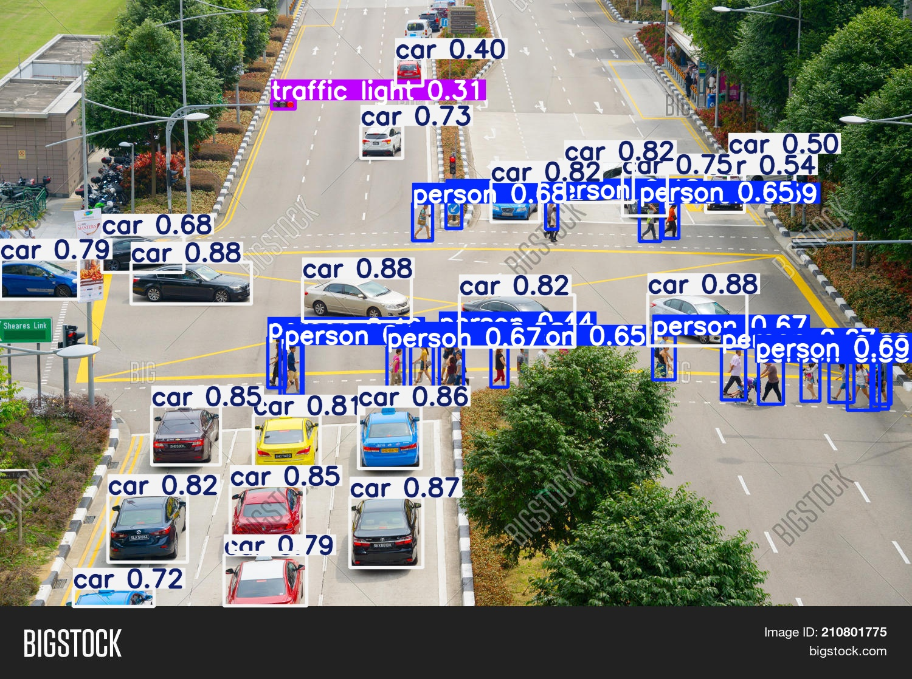
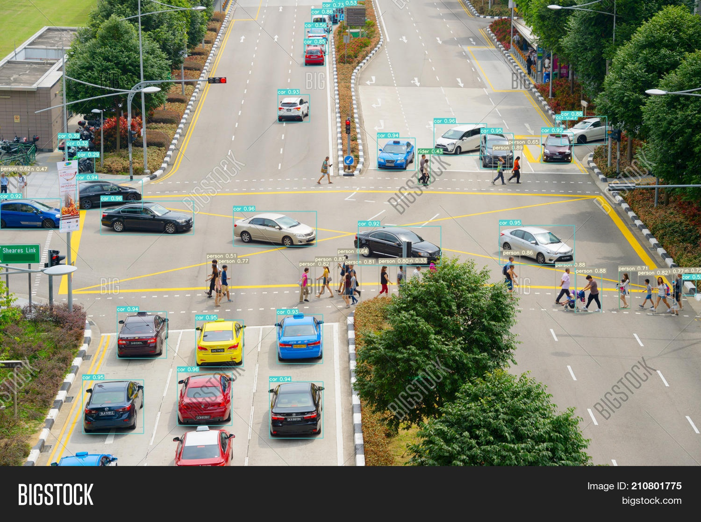

# Edge Ready ADAS: Real-Time Object Detection with Model Switching

This project implements a **real-time object detection system** for **Advanced Driver Assistance Systems (ADAS)** that dynamically switches between lightweight and heavyweight YOLO models based on system resource availability (CPU and RAM usage).

## 🚗 Project Objective

Optimize object detection performance on resource-constrained edge devices (e.g., Jetson Nano, Raspberry Pi) by:

- Implementing an **adaptive model-switching strategy** that balances safety (accuracy) with system health (latency)
- Using a **lightweight model (YOLOv11S)** to maintain baseline detection reliability during high system load
- Scaling to a **high-precision model (YOLOv7X)** when sufficient hardware resources are available
- Driving switching decisions using **real-time hardware telemetry** collected via `psutil`

---

## 🧠 Key Features

- **Intelligent Adaptive Controller**  
  A custom `ModelManager` class monitors CPU and RAM usage in real time and orchestrates model transitions based on system conditions.

- **Hysteresis-Based Switching**  
  Prevents inference jitter by requiring system resources to remain stable for a predefined duration (e.g., 5 seconds) before switching models.

- **Asynchronous Process Management**  
  Uses non-blocking execution to ensure continuous system monitoring while handling heavy model initialization and termination.

- **BDD100K-Trained Models**  
  Includes YOLOv7X and YOLOv11S models fine-tuned on the BDD100K dataset for diverse driving environments.

## 📚 Project Requirements

To reproduce or test this project, make sure to have the following:

### 🔸 Dataset

- **[BDD100K](https://bdd-data.berkeley.edu/):**  
  A diverse driving dataset used for training the YOLO models.

  📥 Download Link: [https://bdd-data.berkeley.edu](https://bdd-data.berkeley.edu)

### 🔸 YOLO Model Repositories

We used official implementations of two YOLO models:

- 🔹 **YOLOv7 (for heavy model)**  
  GitHub: [https://github.com/WongKinYiu/yolov7](https://github.com/WongKinYiu/yolov7)  
  Used for accurate but resource-heavy inference.

- 🔹 **YOLOv11S (for lightweight model)**  
  GitHub: [https://github.com/ultralytics/ultralytics](https://github.com/ultralytics/ultralytics)  
  Used when system resources (CPU/RAM) are constrained.

> Note: Ensure you clone the YOLOv7 repository and install the ultralytics package using pip install ultralytics before running inference.

### 🚀 How to Run

To start the adaptive ADAS system, run the master controller script.  
This script will automatically monitor your system resources and switch between the **Heavy (YOLOv7)** and **Light (YOLO11)** models.

```bash
python pesutil.py
```

## 🛠️ What Happens During Execution
### 🔍 Hardware Monitoring
The script uses psutil to check your real-time CPU and RAM usage.

### 🤖 Dynamic Selection & Advanced Controller Logic
The system doesn't just switch models blindly; it uses an Adaptive Controller to manage hardware constraints:

- **Hysteresis & Smoothing:** To prevent rapidly switching between models due to momentary CPU spikes, a stability threshold is implemented. The system must detect consistent resource availability for a set duration (e.g., 5 seconds) before triggering a switch.

- **Process Management:** The controller uses non-blocking subprocesses (Popen) to actively terminate the previous model's memory footprint before initializing the next, ensuring the edge device doesn't crash during transitions.

- **Dynamic Selection:**
If resources are Low (High CPU/RAM), it triggers YOLO11S via yolov11/predict_11s.py.
If resources are Sufficient, it triggers YOLOv7X via yolov7/detect.py.

### 📁 Output
Results are saved in the runs/ directory.

Outputs are categorized based on the model used.

## 🎥 Results

For 11s:



For 7x:



Overall model results:


Detailed results are there under results of their respective model.

>⚠️ While we acknowledge that the current results are not fully satisfactory, they were achieved under significant hardware limitations, strict deadlines, and limited time for optimization. We are actively working on improving the model’s precision and recall, which will require further tuning and experimentation in future iterations.


## 📦 Model Files

Due to GitHub's file size limitations (100MB max per file on the free tier), we could not upload our trained YOLO models (`yolov7x_best.pt` and `yolov11s_best.pt`) to this repository.

## 🛠️ Technologies Used

- Python
- YOLOv7 and YOLOv11S (Ultralytics)
- OpenCV
- psutil
- PyTorch
- TensorRT (planned)
- ONNX Runtime (planned)

## 📈 Future Work

- Integrate GPU-based switching
- Warm-Starting: Implementing background threading to keep the lightweight model "warm" in memory for instantaneous fail-safes.
- Add LiDAR + camera fusion (multimodal)
- Deploy to Jetson Nano / Raspberry Pi and benchmark FPS
- Add alert system (pedestrian crossing, etc.)

## 👨‍💻 Authors

- Dhatri P Sriram
- Aritra Ghosh Dastidar
- Disha Bharadwaj


